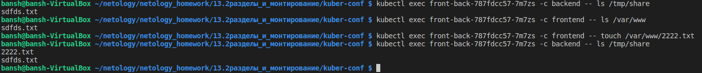

# Домашнее задание к занятию "13.2 разделы и монтирование"

Приложение запущено и работает, но время от времени появляется необходимость передавать между бекендами данные. А сам бекенд генерирует статику для фронта. Нужно оптимизировать это.
Для настройки NFS сервера можно воспользоваться следующей инструкцией (производить под пользователем на сервере, у которого есть доступ до kubectl):

* установить helm: curl <https://raw.githubusercontent.com/helm/helm/master/scripts/get-helm-3> | bash
* добавить репозиторий чартов: helm repo add stable <https://charts.helm.sh/stable> && helm repo update
* установить nfs-server через helm: helm install nfs-server stable/nfs-server-provisioner

В конце установки будет выдан пример создания PVC для этого сервера.

## Задание 1: подключить для тестового конфига общую папку

В stage окружении часто возникает необходимость отдавать статику бекенда сразу фронтом. Проще всего сделать это через общую папку. Требования:

* в поде подключена общая папка между контейнерами (например, /static);
* после записи чего-либо в контейнере с беком файлы можно получить из контейнера с фронтом.

  

## Задание 2: подключить общую папку для прода

Поработав на stage, доработки нужно отправить на прод. В продуктиве у нас контейнеры крутятся в разных подах, поэтому потребуется PV и связь через PVC. Сам PV должен быть связан с NFS сервером. Требования:

* все бекенды подключаются к одному PV в режиме ReadWriteMany;
* фронтенды тоже подключаются к этому же PV с таким же режимом;
* файлы, созданные бекендом, должны быть доступны фронту.


```bash
root@master1:~/pvs-test# kubectl get pods -o wide
NAME                                  READY   STATUS    RESTARTS   AGE    IP            NODE      NOMINATED NODE   READINESS GATES
backend-7dc6cb96b7-8psbd              1/1     Running   0          99s    10.233.96.6   master3   <none>           <none>
backend-7dc6cb96b7-lhnbw              1/1     Running   0          99s    10.233.97.7   master1   <none>           <none>
backend-7dc6cb96b7-sjzls              1/1     Running   0          99s    10.233.98.7   master2   <none>           <none>
frontend-569877984c-4w7km             1/1     Running   0          105s   10.233.97.6   master1   <none>           <none>
frontend-569877984c-lzndv             1/1     Running   0          105s   10.233.96.5   master3   <none>           <none>
frontend-569877984c-w56z6             1/1     Running   0          105s   10.233.98.6   master2   <none>           <none>
nfs-server-nfs-server-provisioner-0   1/1     Running   0          27m    10.233.98.3   master2   <none>           <none>

root@master1:~/pvs-test# kubectl exec backend-7dc6cb96b7-8psbd -- touch /tmp/share/test.txt
root@master1:~/pvs-test#

root@master1:~/pvs-test# kubectl exec backend-7dc6cb96b7-sjzls -- ls /tmp/share
test.txt
root@master1:~/pvs-test# kubectl exec frontend-569877984c-lzndv -- ls /var/www/
test.txt
root@master1:~/pvs-test# kubectl exec frontend-569877984c-4w7km -- ls /var/www/
test.txt
root@master1:~/pvs-test#

```
---

### Как оформить ДЗ?

Выполненное домашнее задание пришлите ссылкой на .md-файл в вашем репозитории.

---
