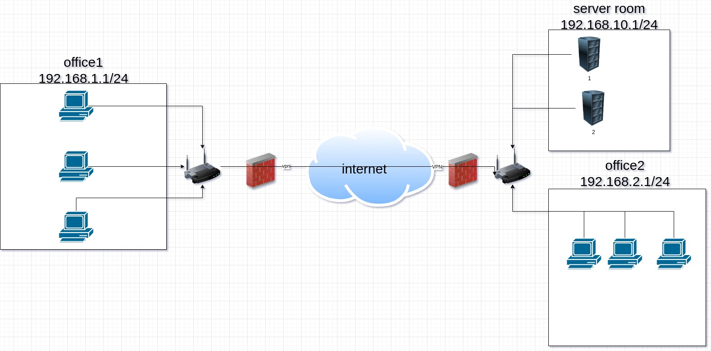

# 3.8. Компьютерные сети, лекция 3

1. ```shell
    route-views>show ip route 87.117.62.43
    Routing entry for 87.117.60.0/22
    Known via "bgp 6447", distance 20, metric 10
    Tag 3257, type external
    Last update from 89.149.178.10 01:38:49 ago
    Routing Descriptor Blocks:
   * 89.149.178.10, from 89.149.178.10, 01:38:49 ago
       Route metric is 10, traffic share count is 1
       AS Hops 2
       Route tag 3257
       MPLS label: none
    route-views>show bgp 87.117.62.43
    BGP routing table entry for 87.117.60.0/22, version 248641110
    Paths: (25 available, best #23, table default)
   Not advertised to any peer
   Refresh Epoch 1
   20912 3257 12389
     212.66.96.126 from 212.66.96.126 (212.66.96.126)
       Origin IGP, localpref 100, valid, external
       Community: 3257:4000 3257:8921 3257:50001 3257:50110 3257:54600 3257:54601 20912:65004
       path 7FE10C0ECC18 RPKI State valid
       rx pathid: 0, tx pathid: 0
   Refresh Epoch 1
   3267 3356 12389
     194.85.40.15 from 194.85.40.15 (185.141.126.1)
       Origin IGP, metric 0, localpref 100, valid, external
       path 7FE0FF50F800 RPKI State valid
       rx pathid: 0, tx pathid: 0
   Refresh Epoch 1
   3333 1103 12389
     193.0.0.56 from 193.0.0.56 (193.0.0.56)
       Origin incomplete, localpref 100, valid, external
       path 7FE10F13F0C8 RPKI State valid
       rx pathid: 0, tx pathid: 0
   Refresh Epoch 1
   3561 3910 3356 12389
     206.24.210.80 from 206.24.210.80 (206.24.210.80)
       Origin IGP, localpref 100, valid, external
       path 7FE1043E1810 RPKI State valid
       rx pathid: 0, tx pathid: 0
   Refresh Epoch 1
   7018 3257 12389
     12.0.1.63 from 12.0.1.63 (12.0.1.63)
       Origin IGP, localpref 100, valid, external
     --More-- 

    ```


2. ```shell
   root@vagrant:~/# echo "options dummy numdummies=2" > /etc/modprobe.d/dummy.conf
   
   root@vagrant:~# cat /etc/network/interfaces
    # interfaces(5) file used by ifup(8) and ifdown(8)
    # Include files from /etc/network/interfaces.d:
    source-directory /etc/network/interfaces.d
    auto dummy0
    iface dummy0 inet static
    address 192.168.101.1/24
    pre-up ip link add dummy0 type dummy
    post-down ip link del dummy0 type dummy
   
   root@vagrant:~# modprobe -v dummy numdummies=2
    insmod /lib/modules/5.4.0-73-generic/kernel/drivers/net/dummy.ko numdummies=0 numdummies=2
   
   root@vagrant:~# ip a
    1: lo: <LOOPBACK,UP,LOWER_UP> mtu 65536 qdisc noqueue state UNKNOWN group default qlen 1000
        link/loopback 00:00:00:00:00:00 brd 00:00:00:00:00:00
        inet 127.0.0.1/8 scope host lo
           valid_lft forever preferred_lft forever
        inet6 ::1/128 scope host
           valid_lft forever preferred_lft forever
    2: eth0: <BROADCAST,MULTICAST,UP,LOWER_UP> mtu 1500 qdisc fq_codel state UP group default qlen 1000
        link/ether 08:00:27:e3:90:c5 brd ff:ff:ff:ff:ff:ff
        inet 10.0.2.15/24 brd 10.0.2.255 scope global dynamic eth0
           valid_lft 86384sec preferred_lft 86384sec
        inet6 fe80::a00:27ff:fee3:90c5/64 scope link
           valid_lft forever preferred_lft forever
    3: dummy0: <BROADCAST,NOARP,UP,LOWER_UP> mtu 1500 qdisc noqueue state UNKNOWN group default qlen 1000
        link/ether 62:cf:61:0a:a6:21 brd ff:ff:ff:ff:ff:ff
        inet 192.168.101.1/24 brd 192.168.101.255 scope global dummy0
           valid_lft forever preferred_lft forever
        inet6 fe80::60cf:61ff:fe0a:a621/64 scope link
           valid_lft forever preferred_lft forever
   
   root@vagrant:~# ip route add 172.16.10.0/24 dev dummy0
   root@vagrant:~# ip route add 8.8.4.4/32 dev dummy0
   root@vagrant:~# ip route
    default via 10.0.2.2 dev eth0 proto dhcp src 10.0.2.15 metric 100
    8.8.4.4 dev dummy0 scope link
    10.0.2.0/24 dev eth0 proto kernel scope link src 10.0.2.15
    10.0.2.2 dev eth0 proto dhcp scope link src 10.0.2.15 metric 100
    172.16.10.0/24 dev dummy0 scope link
    192.168.101.0/24 dev dummy0 proto kernel scope link src 192.168.101.1
   ```
   
3. ```shell
    root@vagrant:~# ss -tnap
    State     Recv-Q    Send-Q       Local Address:Port       Peer Address:Port    Process
    LISTEN    0         4096         127.0.0.53%lo:53              0.0.0.0:*        users:(("systemd-resolve",pid=612,fd=13))
    LISTEN    0         128                0.0.0.0:22              0.0.0.0:*        users:(("sshd",pid=888,fd=3))
    LISTEN    0         4096               0.0.0.0:111             0.0.0.0:*        users:(("rpcbind",pid=610,fd=4),("systemd",pid=1,fd=35))
    ESTAB     0         0                10.0.2.15:22             10.0.2.2:61818    users:(("sshd",pid=1038,fd=4),("sshd",pid=1001,fd=4))
    LISTEN    0         511                      *:80                    *:*        users:(("apache2",pid=919,fd=4),("apache2",pid=918,fd=4),("apache2",pid=917,fd=4))
    LISTEN    0         128                   [::]:22                 [::]:*        users:(("sshd",pid=888,fd=4))
    LISTEN    0         511                      *:443                   *:*        users:(("apache2",pid=919,fd=6),("apache2",pid=918,fd=6),("apache2",pid=917,fd=6))
    LISTEN    0         4096                  [::]:111                [::]:*        users:(("rpcbind",pid=610,fd=6),("systemd",pid=1,fd=37))
    ```
видим апач это 80 и 443, ssh на 22, и тд..

4. ```shell
    root@vagrant:~# ss -unap
    State        Recv-Q       Send-Q              Local Address:Port             Peer Address:Port       Process
    UNCONN       0            0                   127.0.0.53%lo:53                    0.0.0.0:*           users:(("systemd-resolve",pid=612,fd=12))
    UNCONN       0            0                  10.0.2.15%eth0:68                    0.0.0.0:*           users:(("systemd-network",pid=413,fd=19))
    UNCONN       0            0                         0.0.0.0:111                   0.0.0.0:*           users:(("rpcbind",pid=610,fd=5),("systemd",pid=1,fd=36))
    UNCONN       0            0                            [::]:111                      [::]:*           users:(("rpcbind",pid=610,fd=7),("systemd",pid=1,fd=38))
    ```
   
53 порт используется для днс в даном случае заворачивается на файл hosts

111 rpcbind 

68 dhcp lient

5. 