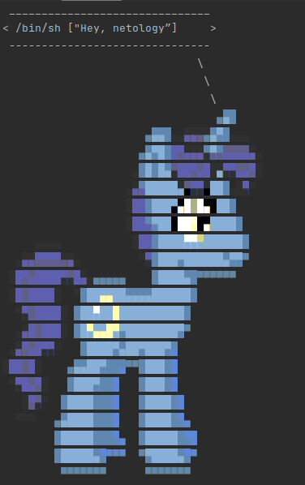

# Домашнее задание к занятию "5.4. Практические навыки работы с Docker"

## Задача 1 

В данном задании вы научитесь изменять существующие Dockerfile, адаптируя их под нужный инфраструктурный стек.

Измените базовый образ предложенного Dockerfile на Arch Linux c сохранением его функциональности.

```text
FROM ubuntu:latest

RUN apt-get update && \
    apt-get install -y software-properties-common && \
    add-apt-repository ppa:vincent-c/ponysay && \
    apt-get update
 
RUN apt-get install -y ponysay

ENTRYPOINT ["/usr/bin/ponysay"]
CMD ["Hey, netology”]
```

Для получения зачета, вам необходимо предоставить:
- Написанный вами Dockerfile
- Скриншот вывода командной строки после запуска контейнера из вашего базового образа
- Ссылку на образ в вашем хранилище docker-hub

## Ответ:
```shell
FROM archlinux:latest
RUN pacman-db-upgrade && pacman -Syyu --noconfirm
RUN pacman -Sy --noconfirm ponysay
ENTRYPOINT ["/usr/bin/ponysay"]
CMD ["Hey, netology”]
```


https://hub.docker.com/repository/docker/bansh/hey-netology
## Задача 2 

В данной задаче вы составите несколько разных Dockerfile для проекта Jenkins, опубликуем образ в `dockerhub.io` и посмотрим логи этих контейнеров.

- Составьте 2 Dockerfile:

    - Общие моменты:
        - Образ должен запускать [Jenkins server](https://www.jenkins.io/download/)
        
    - Спецификация первого образа:
        - Базовый образ - [amazoncorreto](https://hub.docker.com/_/amazoncorretto)
        - Присвоить образу тэг `ver1` 
    
    - Спецификация второго образа:
        - Базовый образ - [ubuntu:latest](https://hub.docker.com/_/ubuntu)
        - Присвоить образу тэг `ver2` 

- Соберите 2 образа по полученным Dockerfile
- Запустите и проверьте их работоспособность
- Опубликуйте образы в своём dockerhub.io хранилище

Для получения зачета, вам необходимо предоставить:
- Наполнения 2х Dockerfile из задания
- Скриншоты логов запущенных вами контейнеров (из командной строки)
- Скриншоты веб-интерфейса Jenkins запущенных вами контейнеров (достаточно 1 скриншота на контейнер)
- Ссылки на образы в вашем хранилище docker-hub

##     Ответ:
```shell
FROM amazoncorretto:latest
ADD https://get.jenkins.io/war-stable/2.303.1/jenkins.war /opt/jenkins.war
ADD ./entrypoint1.sh /entrypoint1.sh
ENTRYPOINT ["/entrypoint1.sh"]
```
```bash
FROM ubuntu:20.04
RUN apt-get update && apt-get install -y wget  software-properties-common && \
    wget -q -O - https://pkg.jenkins.io/debian-stable/jenkins.io.key | apt-key add - && \
    sh -c 'echo deb https://pkg.jenkins.io/debian-stable binary/ > /etc/apt/sources.list.d/jenkins.list' && \
    apt-get update && apt-get install jenkins default-jre default-jdk -y
ADD ./entrypoint2.sh /entrypoint2.sh
ENTRYPOINT ["/entrypoint2.sh"]
```
```bash
bansh@bansh-VirtualBox ~/netology/netology_homework $ docker ps
CONTAINER ID   IMAGE            COMMAND             CREATED          STATUS          PORTS                                       NAMES
907018e037da   ubuntu-jenkins   "/entrypoint2.sh"   13 seconds ago   Up 10 seconds   0.0.0.0:8081->8080/tcp, :::8081->8080/tcp   heuristic_turing
e920d776502d   amazon-jenkins   "/entrypoint1.sh"   39 seconds ago   Up 37 seconds   0.0.0.0:8080->8080/tcp, :::8080->8080/tcp   distracted_ritchie
bansh@bansh-VirtualBox ~/netology/netology_homework $ docker logs -n10 heuristic_turing 

*************************************************************
*************************************************************
*************************************************************

2021-09-11 14:22:25.140+0000 [id=38]    INFO    jenkins.InitReactorRunner$1#onAttained: Completed initialization
2021-09-11 14:22:25.153+0000 [id=23]    INFO    hudson.WebAppMain$3#run: Jenkins is fully up and running
2021-09-11 14:22:25.708+0000 [id=51]    INFO    h.m.DownloadService$Downloadable#load: Obtained the updated data file for hudson.tasks.Maven.MavenInstaller
2021-09-11 14:22:25.708+0000 [id=51]    INFO    hudson.util.Retrier#start: Performed the action check updates server successfully at the attempt #1
2021-09-11 14:22:25.711+0000 [id=51]    INFO    hudson.model.AsyncPeriodicWork#lambda$doRun$0: Finished Download metadata. 15,357 ms
bansh@bansh-VirtualBox ~/netology/netology_homework $ docker logs -n10 distracted_ritchie

*************************************************************
*************************************************************
*************************************************************

2021-09-11 14:21:55.547+0000 [id=32]    INFO    jenkins.InitReactorRunner$1#onAttained: Completed initialization
2021-09-11 14:21:55.558+0000 [id=21]    INFO    hudson.WebAppMain$3#run: Jenkins is fully up and running
2021-09-11 14:21:57.557+0000 [id=49]    INFO    h.m.DownloadService$Downloadable#load: Obtained the updated data file for hudson.tasks.Maven.MavenInstaller
2021-09-11 14:21:57.558+0000 [id=49]    INFO    hudson.util.Retrier#start: Performed the action check updates server successfully at the attempt #1
2021-09-11 14:21:57.561+0000 [id=49]    INFO    hudson.model.AsyncPeriodicWork#lambda$doRun$0: Finished Download metadata. 13,407 ms
```


https://hub.docker.com/r/bansh/ubuntu-jenkins
https://hub.docker.com/r/bansh/amazon-jenkins
## Задача 3 

В данном задании вы научитесь:
- объединять контейнеры в единую сеть
- исполнять команды "изнутри" контейнера

Для выполнения задания вам нужно:
- Написать Dockerfile: 
    - Использовать образ https://hub.docker.com/_/node как базовый
    - Установить необходимые зависимые библиотеки для запуска npm приложения https://github.com/simplicitesoftware/nodejs-demo
    - Выставить у приложения (и контейнера) порт 3000 для прослушки входящих запросов  
    - Соберите образ и запустите контейнер в фоновом режиме с публикацией порта

- Запустить второй контейнер из образа ubuntu:latest 
- Создайть `docker network` и добавьте в нее оба запущенных контейнера
- Используя `docker exec` запустить командную строку контейнера `ubuntu` в интерактивном режиме
- Используя утилиту `curl` вызвать путь `/` контейнера с npm приложением  


Для получения зачета, вам необходимо предоставить:
- Наполнение Dockerfile с npm приложением
- Скриншот вывода вызова команды списка docker сетей (docker network cli)
- Скриншот вызова утилиты curl с успешным ответом

## Ответ:
```shell
bansh@bansh-VirtualBox $ $ docker run -d -p 3000:3000 --network todo-app --network-alias node bansh/npm-app
721c813ca0e0706e675caceb7e0ec37c194ccff76be4eff05a7d28c4464a237d
bansh@bansh-VirtualBox $ $ docker run -it --network todo-app bansh/ubuntu-curl
root@d35ed9532cf2:/# curl node:3000 | tail -n10
  % Total    % Received % Xferd  Average Speed   Time    Time     Time  Current
                                 Dload  Upload   Total   Spent    Left  Speed
100  513k  100  513k    0     0   399k      0  0:00:01  0:00:01 --:--:--  399k
      var p = ps[i];
      pc.append(
        $('<li/>')
          .append($('', { title: p.demoPrdReference, src: 'data:' + p.demoPrdPicture.mime + ';base64,' + p.demoPrdPicture.content }))
          .append($('<h1/>').append(p.demoPrName))
          .append($('<h2/>').append(p.demoPrdReference))
          .append($('<p/>').append(p.demoPrdDescription))
        );
    }
});</script></head><body><div id="nodejs-demo"><div class="text-center" id="header"></div><ul id="nodejs-demo-products"></ul><p class="text-right">&copy; Simplict&eacute; Software, powered by&nbsp;<a href="https://expressjs.com" target="_blank">Express</a></p></div></body></html>root@d35ed9532cf2:/# 
root@d35ed9532cf2:/# exit
exit
bansh@bansh-VirtualBox $ $ docker network inspect todo-app
[
    {
        "Name": "todo-app",
        "Id": "74ff59cf69134a9091ef3c810c382f2e8ac1115c1daf2037a38caf6e4783fb1b",
        "Created": "2021-09-11T18:05:16.670015393+03:00",
        "Scope": "local",
        "Driver": "bridge",
        "EnableIPv6": false,
        "IPAM": {
            "Driver": "default",
            "Options": {},
            "Config": [
                {
                    "Subnet": "172.18.0.0/16",
                    "Gateway": "172.18.0.1"
                }
            ]
        },
        "Internal": false,
        "Attachable": false,
        "Ingress": false,
        "ConfigFrom": {
            "Network": ""
        },
        "ConfigOnly": false,
        "Containers": {
            "721c813ca0e0706e675caceb7e0ec37c194ccff76be4eff05a7d28c4464a237d": {
                "Name": "quizzical_heyrovsky",
                "EndpointID": "becc25e1ace81cc886ccebc86b82bc624958b71261b86deb2cea211a83737b30",
                "MacAddress": "02:42:ac:12:00:02",
                "IPv4Address": "172.18.0.2/16",
                "IPv6Address": ""
            }
        },
        "Options": {},
        "Labels": {}
    }
]

```